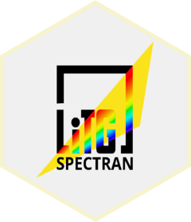
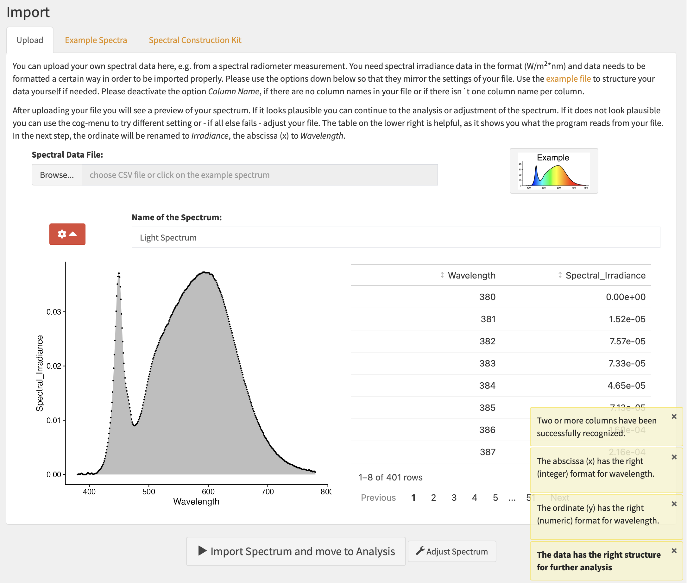

<!-- README.md is generated from README.Rmd. Please edit that file -->

```{r, include = FALSE}
knitr::opts_chunk$set(
  collapse = TRUE,
  comment = "#>",
  fig.path = "man/figures/README-",
  out.width = "100%"
)
```

# Spectran 

<!-- badges: start -->

[](https://github.com/LiTGde/Spectran/actions/workflows/R-CMD-check.yaml)

<!-- badges: end -->

LiTG Spectran is a tool to analyse light spectra for visual and non-visual (so-called melanopic) needs, wrapped up in a Shiny App. Spectran allows for the import of spectra in various csv forms but also provides a wide range of example spectra and even the creation of own spectral distributions. The goal of the app is to provide easy access and a visual overview of the spectral calculations underlying common parameters. It is thus ideal for educational purposes or the creation of presentation ready graphs in lighting research and application.

## Installation

You can install the latest release version of Spectran from [GitHub](https://github.com/) with:

``` r
# install.packages("devtools")
devtools::install_github("LiTGde/Spectran@*release")
```

You can install the development version of Spectran from [GitHub](https://github.com/) with:

``` r
# install.packages("devtools")
devtools::install_github("LiTGde/Spectran")
```

## How to use Spectran

The commands show how to start Spectran:

`library(Spectran)`

`Spectran()`

or simply go to the example hosted on [shinyapps.io](https://litg.shinyapps.io/Spectran_en/).

You can also use the German version:

`Spectran(lang_setting = "Deutsch")`

or go to it´s example on [shinyapps.io](https://litg.shinyapps.io/Spectran_de/).

## Example Screenshots





