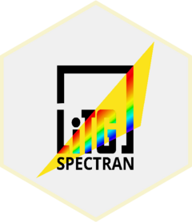
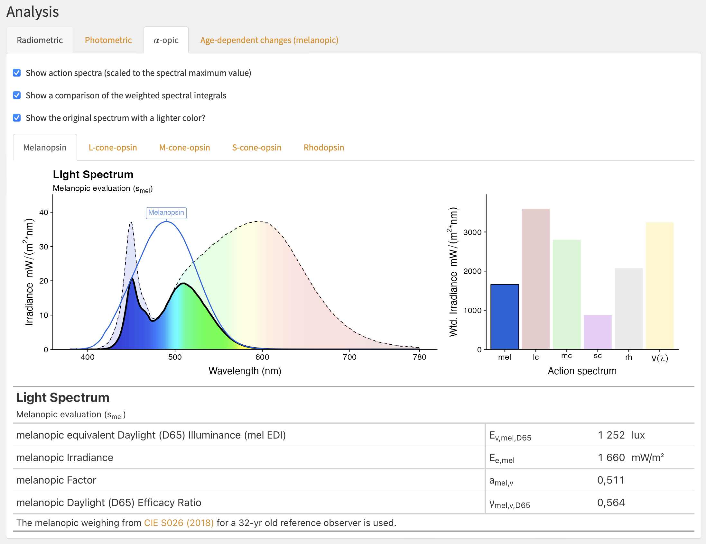
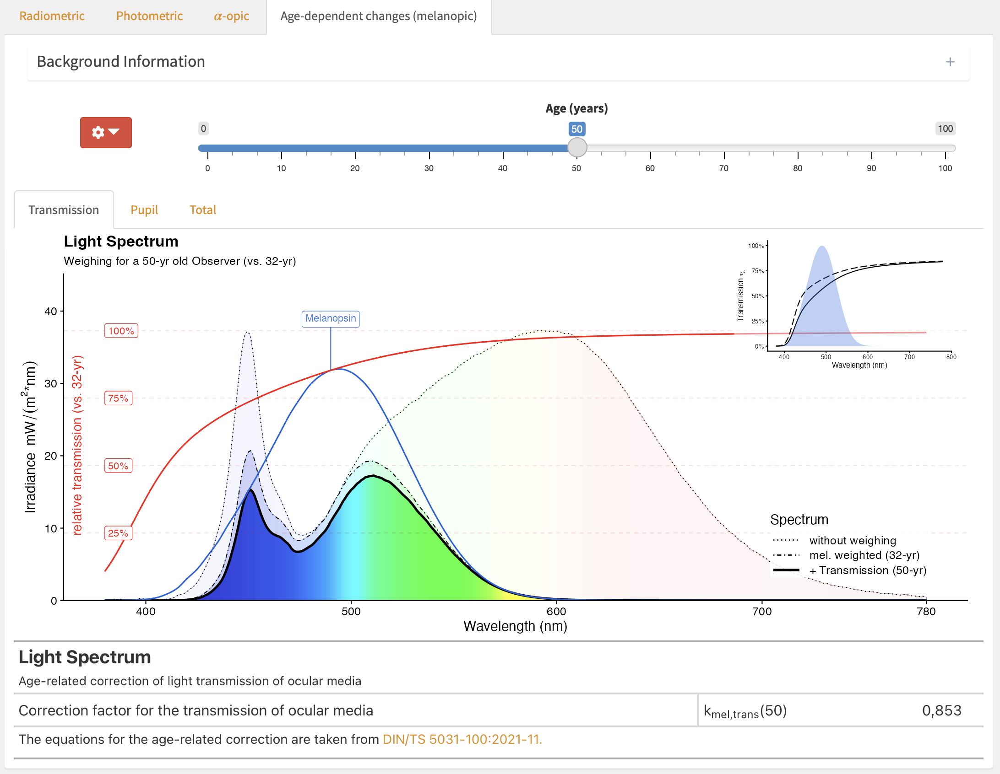
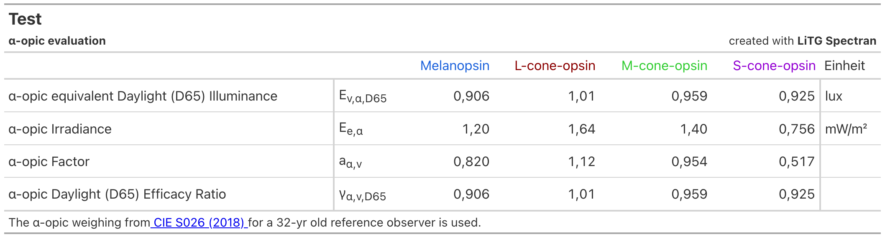
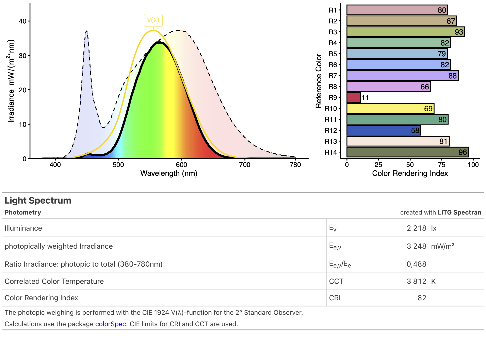
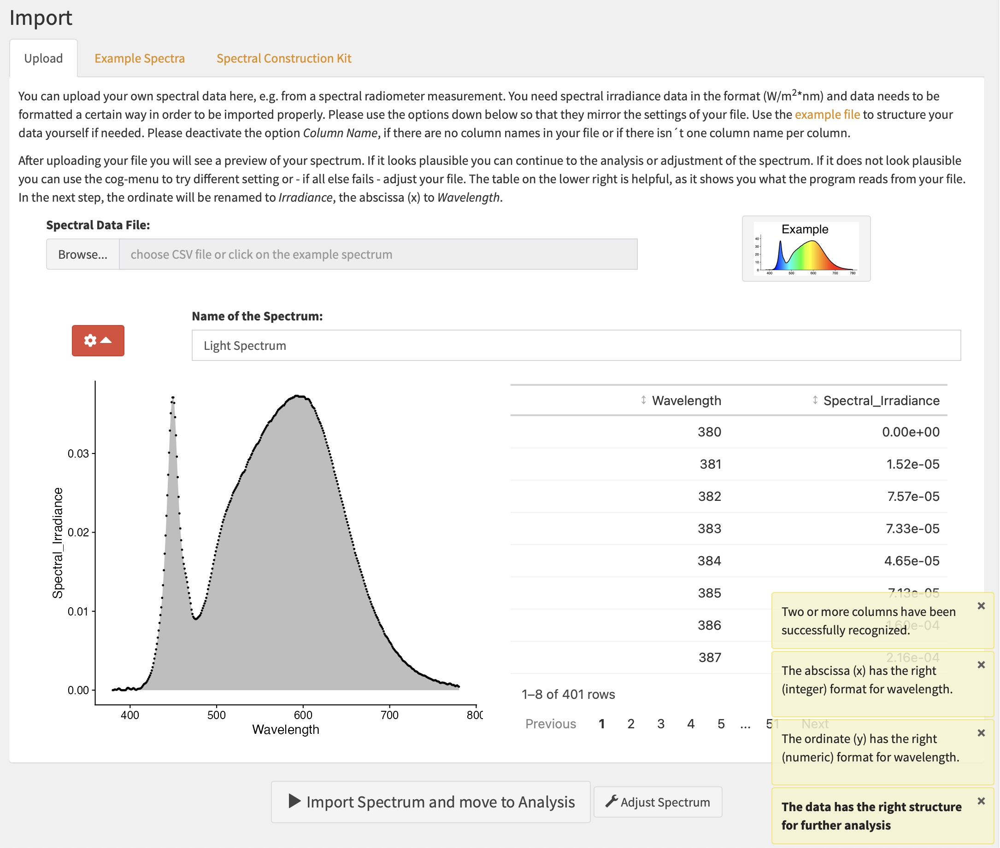
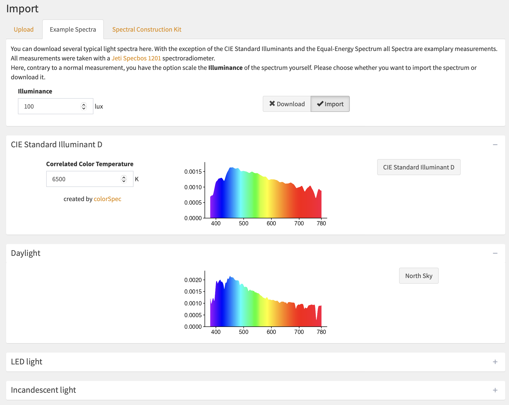

<!-- README.md is generated from README.Rmd. Please edit that file -->

# Spectran 

<!-- badges: start -->

[](https://github.com/LiTGde/Spectran/actions/workflows/R-CMD-check.yaml)
[](https://CRAN.R-project.org/package=Spectran)
[](https://doi.org/10.5281/zenodo.11518043)
<!-- badges: end -->

`Spectran`, developed by the German Society for Lighting Technology and
Lighting Design (LiTG), is a Shiny App designed to analyze light spectra
for both visual and non-visual (also known as melanopic) needs. The app
supports the import of spectral data in CSV or text formats and also
offers an extensive library of example spectra. Users can even create
their own spectral distributions within the app. The primary aim of
Spectran is to offer easy access to and a visual representation of the
calculations that underlie commonly used parameters. As such, it serves
as an ideal tool for educational purposes and for generating
presentation-ready graphs in lighting research and application.

## Installation

You can install the stable release version of Spectran from
[CRAN](https://CRAN.R-project.org/package=Spectran) with:

``` r
install.packages("Spectran")
```

You can install the latest development version of Spectran from
[GitHub](https://github.com/) with:

``` r
# install.packages("devtools")
devtools::install_github("LiTGde/Spectran")
```

## How to use Spectran

The commands show how to start Spectran:

`library(Spectran)`

`Spectran()`

or simply go to the example hosted on
[shinyapps.io](https://litg.shinyapps.io/Spectran_en/).

You can also use the German version:

`Spectran(lang_setting = "Deutsch")`

or go to it´s example on
[shinyapps.io](https://litg.shinyapps.io/Spectran_de/).

## Example Screenshots

<figure>

<figcaption aria-hidden="true">User Interface (UI) for Melanopic
Analysis</figcaption>
</figure>

<figure>

<figcaption aria-hidden="true">UI for Analysis of Age-dependent
changes</figcaption>
</figure>

<figure>

<figcaption aria-hidden="true">Export Table for Alpha-opic
Quantities</figcaption>
</figure>

<figure>

<figcaption aria-hidden="true">Export File for Photometric
Quantities</figcaption>
</figure>

<figure>

<figcaption aria-hidden="true">UI for File Import</figcaption>
</figure>

<figure>

<figcaption aria-hidden="true">UI for Example Spectra
Import</figcaption>
</figure>
